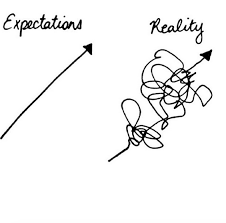

```{r setup, include=FALSE}
library(tufte)
# invalidate cache when the tufte version changes
knitr::opts_chunk$set(tidy = FALSE, cache.extra = packageVersion('tufte'))
options(htmltools.dir.version = FALSE)
```
# Introduction

## What is version control and why should I use it?
<a id="usual_exps"></a>
```{r proj_exp_real, fig.margin = TRUE, fig.cap = "How projects usually go.", out.width="70%", cache=TRUE, message=FALSE, echo=FALSE}

```

It goes without saying that path from a first draft of a project/paper to its final form is a tortuous one (figure 1).
It is crucial to keep track of how these projects evolve while threading such path. 
Otherwise how could resurrect that brilliant sentence/paragraph you wrote, ended up deleting but now, after thinking a bit more, you came to the conclusion that it totally deserves a place in your document?
How could sleep at night without the warm, fuzzy feeling that only knowing you can try that cutting-edge Bayesian analysis and, if it utterly breaks your script, you can safely open a previous (working) version of your code?

```{r version_cont_ind, fig.margin = T, fig.cap = "", cache=TRUE, echo=FALSE, fig.height=2, fig.width=2, fig.cap="Version control when working alone. The colored lines represent changes made to a base file that were then assimilated, resulting in two new versions of such file."}
fig_svg<-cowplot::ggdraw()+cowplot::draw_image("images/02-version-control-individual.svg")
plot(fig_svg)
```

There are different ways of tracking how your projects change. 
Some people do so using Dropbox/Google Drive automated version tracking, others manually save multiple copies of their files with slightly different names that are sometimes sensible (e.g., including the date), sometimes not (e.g., "thesis-final", "thesis-final-FINAL", "thesis-final-FINAL-this_time_im_sure_of_it", and so on).
These are all forms of version control and I am guilty of doing all of them (among others). 
Today we will discuss how to ~~hopefully~~ do it better though.

> "Alright, but what exactly is version control?"
>
> `r tufte::quote_footer('--- You right now')`

```{r version_cont_collab, fig.margin = T, cache=TRUE, echo=FALSE, fig.height=2, fig.width=2, fig.cap="Version control when collaborating. The colored lines represent simultaneous changes made to different parts of a base file that were then assimlated, resulting in a new version of such file."}
fig_svg<-cowplot::ggdraw()+cowplot::draw_image("images/03-version-control-collab.svg")
plot(fig_svg)
```

Basically, version control is a file management system/tool.
The idea behind is simple: you start with a base file that you will work on.
Version control tools keep track of the changes you make to your files (figure 2) so you can clearly visualize _what_ is different in the different versions of your files.
This also works seamlessly for multiple people as long as they work on different parts of the a given base file (figure 3).
Multiple people working on the same part of the base file generates a *conflict*. The changes can still be incorporated into the base file but it may not be as straightforward as when there are no conflicts.
Today we will talk about version control system called *Git* and how to backup the info you record using it online using *GitHub*.

## What is Git? What is GitHub?

Git is a widely used, well maintained, open source version control system.
It has been around since its inception in 2005 by Linus Torvalds.
It works a lot like other version control systems: you tell git which files you would like it to track, it registers what is in your base files and records subsequent changes to said file (figure 4).

```{r fig_margin, fig.margin = TRUE, fig.cap = "Git when you change the files you asked them to track.", out.width="70%", cache=TRUE, message=FALSE, echo=FALSE}

```

> "And so what? Dropbox/Google drive does the same!"
>
> `r tufte::quote_footer('--- You, once again')`

I am glad you asked!
Git deals better with text files than the two alternatives you brought up: Git saves virtually unlimited versions of your text files while keeping information about who did what changes.
Since code/scripts are often stored as `.txt`, Git is great for tracking this kind of files.
Another important difference is that you can use Git to take snapshots of complete folders, meaning that you easily return to a working version of your code in case something breaks.
Additionally, since it keeps track of the *changes* instead of saving complete copies of your files, it saves you some space.
*GitHub* takes all of these features online, giving you an extra layer of safety (the files you are tracking with git will outlive your computer) and making it easy-peasy to collaboratively change such files.

That's enough background, let's git things going!

<!--  -->


<!--  -->

# Tutorial

*Note:* This tutorial assumes git is currently isntalled in your computer.
You can find more info on how to install Git [here](https://git-scm.com/book/en/v2/Getting-Started-Installing-Git).

## How do I get set up to use Git?

We will start by setting up Git.
Remember Git keeps track of changes and of *who* made them?
Well, for that to happen we need to introduce ourselves to Git.
This is a necessary step whenever using Git for the first time or when you use someone else's computer, for instance.
We will also tell Git which text editor we would like to use by default.

```{r handshake, fig.margin = TRUE, fig.cap = "Nice to meet you!", out.width="70%", cache=TRUE, message=FALSE, echo=FALSE}

```

Start by opening the terminal.
Git commands usually follow this form: `git verb option` where `verb` is what we want to do and `option` is any option our verb may require.
So let's waste no more time and introduce ourselves to Git (figure 5).
We will tell them our (user)name, email, and which text editor we would like to use:


+ Username: `git config --global user.name "First Last"`
+ Email: `git config --global user.email "first.last@provider.com"`
+ Text editor: `git config –global core.editor “nano -w”`

You might have noticed that we used `--global` option for all the commands above.
This configures Git for all projects on our computers and thus eliminates the need to redo this step when working in a different project.
Also, I have chosen nano as my default text editor but you do  not have to do the same.
There is a table at the end of this document with examples showing how to make other text editors the default.

```{r include=FALSE}
text_editors <- tibble::tribble(
  ~ Editor,
  ~
    Configuration.command,
  "Atom",
  "$ git config --global core.editor \"atom --wait\"",
  "nano",
  "$ git config --global core.editor \"nano -w\"",
  "BBEdit (Mac, with command line tools)",
  "$ git config --global core.editor \"bbedit -w\"",
  "Sublime Text (Mac)",
  "$ git config --global core.editor \"/Applications/Sublime\\ Text.app/Contents/SharedSupport/bin/subl -n -w\"",
  "Sublime Text (Win, 32-bit install)",
  "$ git config --global core.editor \"'c:/program files (x86)/sublime text 3/sublime_text.exe' -w\"",
  "Sublime Text (Win, 64-bit install)",
  "$ git config --global core.editor \"'c:/program files/sublime text 3/sublime_text.exe' -w\"",
  "Notepad++ (Win, 32-bit install)",
  "$ git config --global core.editor \"'c:/program files (x86)/Notepad++/notepad++.exe' -multiInst -notabbar -nosession -noPlugin\"",
  "Notepad++ (Win, 64-bit install)",
  "$ git config --global core.editor \"'c:/program files/Notepad++/notepad++.exe' -multiInst -notabbar -nosession -noPlugin\"",
  "Kate (Linux)",
  "$ git config --global core.editor \"kate\"",
  "Gedit (Linux)",
  "$ git config --global core.editor \"gedit --wait --new-window\"",
  "Scratch (Linux)",
  "$ git config --global core.editor \"scratch-text-editor\"",
  "Emacs",
  "$ git config --global core.editor \"emacs\"",
  "Vim",
  "$ git config --global core.editor \"vim\"",
  "VS Code",
  "$ git config --global core.editor \"code --wait\""
)
```

## Creating a local repository/Using Git locally

Now that we are all set we can start using Git to track our files!
To do so we will create a *repository* ^[Git saves your changes in a hidden folder called a *repository*.]

In this section we will create a repository in our own computers, create a repository in it, create some files in our folder, and modify these files to learn how Git tracks changes in our files.

+ Create a folder in an easy to access location;
+ Create a repo in it: `git init`;
+ Create a text file in your newly tracked directory;
+ Run `git status` to see what Git tells you;

## Tracking files

We need two commands to make Git track our files: `git add` and `git commit`.
Try thinking of this process as when you are in the grocery store to buy veggies but end up buying junk food. 
First you *add* that bag of chips to your basked and if, and only if, you *commit* to this "choice" by buying the chips you will have gone through with ~~my~~your impromptu plan.
Another way of thinking of this is that `git add` tells Git which files you want it to track and `git commit` starts the actual tracking;
Now let's track some files:

+ Tell Git to track your text file: `git add your_file.txt`;
+ Run `git status` and see what changed;
+ Confirm the tracking `git commit -m "description of what happened"`^[The "-m" stands for "message", Git displays this text next to the different versions/commits it is tracking. We will use these to readily identify what is in each of our versions so it is important to aim for short, descriptive messages.]
+ Run `git status` and see what changed;

This is it! Now just rinse and repeat and Git will †rack your files for you.
The `git status` are not necessary, we ran them to see how each step looks like.

<!--  -->
<!--  -->

## Restoring a specific version

Now that we have file tracking under our belt we can use Git to go back to a specific version of our tracked file.
We can achieve this by using `git checkout` followed by an identifier of the version we would like to restore.

+ Modify the file once again and add/commit the changes;
+ Use `git log` to see more information about what has changed;
+ Use `git checkout` to recover a  previous version of your file. There are ~~at least~~ two alternatives to do so:
  + Use the ~7 first numbers of the identifier of the version you like to restore as an argument`git checkout 3d3c515 text_file.txt`
  + Use `HEAD~n`^[The most recent version of tracked files is called "HEAD" in Git] where "n" is the number of versions before the current version you would like to restore `git checkout HEAD~n text_file.txt`. For instance, `HEAD~1` reverts to one version before the current one. 

## Git remotely using GitHub

The last thing we will go through today is using GitHub to have a copy of the info we have locally online.
It also makes collaborating/sharing your code easy as pie.
I am familiar with a few workflows for combining Git and GitHub so we will focus on those.

## Start a brand new project in GitHub

The first workflow is for starting a new project. We will create our repository in GitHub, *clone*^[Importantly, when cloning a repository brings you all] (downloading a repository from GitHub for the first time) it, and then work on the project normally. Then, we will upload any work we do locally by *pushing* (uploading) it our changes to GitHub.

+ Create a repository in GitHub;
+ Click clone and copy the URL from the drop down menu;
+ Open your terminal and navigate to the folder where you would like your project to live
+ Clone it: `git clone https://github.com/user-name/repository-name.git`^[You can also download the project as zip file if you prefer]
+ Work on it normally and controlling it (as we discussed in the previous sections)
+ Upload the changes you *added* and *committed* locally by pushing them to GitHub: `git push`

## Joining ongoing project hosted in GitHub

It is common to join ongoing projects and doing so is easy:

+ Clone the repository: `git clone https://github.com/user-name/repository-name.git`^[You can also download the project as zip file if you prefer]
+ Work on it normally and controlling it (as we discussed in the previous sections)
+ Upload the changes you *added* and *committed* locally by pushing them to GitHub: `git push`

## Start tracking a project that lives in your computer

Since we are all new to Git/GitHub we will likely have many projects we are working on right now that would benefit from version control. To do that I create a repository in GitHub, clone it, my project files to the newly cloned repository, add/commit the files, and push them^[I am not sure this is the optimal, it works though...]:

+ Create a repository in GitHub;
+ Click clone and copy the URL from the drop down menu;
+ Open your terminal and navigate to the folder where you would like your project to live
+ Clone it: `git clone https://github.com/user-name/repository-name.git`
+ Copy the your project files into the newly created repository
+ `git add` and `git commit` your files
+ `git push` the newly tracked files
+ Proceed working normally on the project

# Other useful things to keep in mind

## Ignoring files

Git will ignore everything that it in a text file called ".gitignore".

# Additional resources

## Examples showing how to use different text editors as default.

```{r}
knitr::kable(text_editors, caption = "")
```