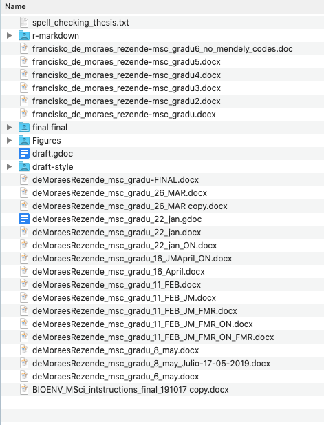
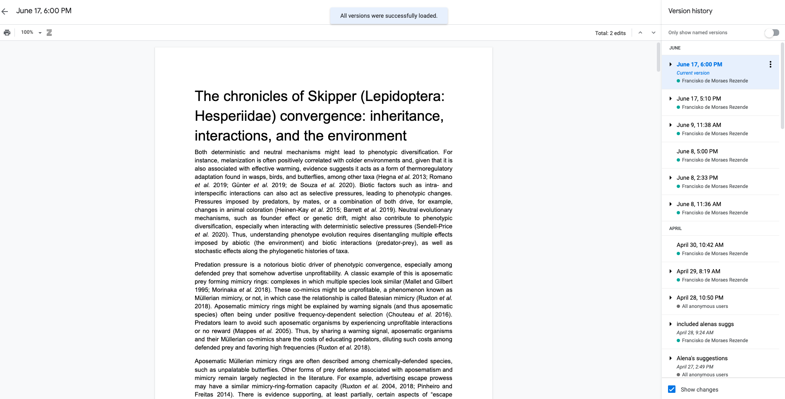
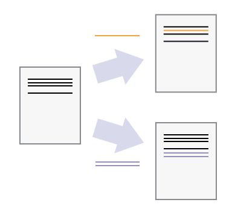
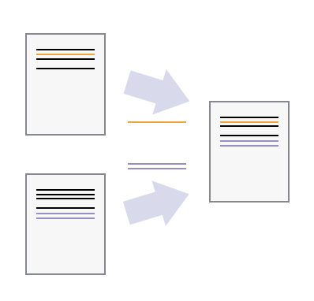

```{r setup, include=FALSE}
options(htmltools.dir.version = FALSE)
library(icon)
library(ggplot2)
```

```{r xaringan-themer, include=FALSE, warning=FALSE}
library(xaringanthemer)
style_duo_accent(
  primary_color = "#447C1F",
  secondary_color = "#DB8018",
  background_color = "#FFF5DA",
  # inverse_header_color = "#FFFFFF",
  header_font_google = google_font("Josefin Sans"),
  text_font_google   = google_font("Montserrat", "300", "300i"),
  code_font_google   = google_font("Fira Mono")
)

# style_mono_accent(
#   base_color = "#447C1F",
#   white_color = "#FFF5DA",
#   header_font_google = google_font("Josefin Sans"),
#   text_font_google   = google_font("Montserrat", "300", "300i"),
#   code_font_google   = google_font("Fira Mono")
# )
```
class: title-slide, left, middle
background-image: url(figs/ben-williams-Q1ntCz0HfKI-unsplash.jpg)
background-size: cover

# Gitting your &#128169;  under control

## `r icon::fa("git-square")` + `r icon::fa("github")`

<b>.large[Francisko de Moraes Rezende

MEP lab 1<sup>st</sup> getaway 

2020-07-04]</b>

---
# Version control: what and why


.pull-left[

]
.pull-right[

]

---

# Version control: what and why

.pull-left[

]
.pull-right[

]

---
# Version control: what and why


<center></center>

---
class: inverse, center, middle
# Setting up Git

---

#Introductions


<center></center>


---

# Introductions

## We need to tell Git:

--

### Our names

--

### Our emails

--

### Our preferred text editor

--


```{bash  eval=FALSE}
git config --global user.name "First Last";

git config --global user.email "first.last@provider.com";

git config --global core.editor "nano-w"
```

---
class: inverse, center, middle

# Git locally
---

# Using Git locally
 
--

## Create a folder

--

## *Init*ialize a repository

--

## Ask Git what's up

--
```{bash  eval=FALSE}
mkdir to-do

git init;

git status
```

---
# Tracking files

--

## Create a file in our *repo*sitory

--

## Add this file to Git's watchlist

--

## Ask Git what's up

--


```{bash eval=FALSE}
echo "potato chips" > shopping_list.txt;

git add shopping_list.txt;

git status
```

---
<!--  -->
---

# Tracking files

## *Commit* the file so Git start tracking it

--

## Ask Git what's up

--

```{bash eval=FALSE}
git commit -m "included essential item to shopping_list.txt"
```

---
# The whole process

<center></center>

---
# Restoring a specific version

<center></center>

---
# Restoring a specific version

## Modify `shopping_list` and track it

--

## Use git log to see more information about what has changed 

--

## Use git checkout to recover a previous version of your file

--

```{bash eval=FALSE}
echo "nuggets" >> shopping_list.txt;
git add shopping_list.txt;
commit shopping_list.txt -m "added nuggets to shopping_list.txt"
git log;
git checkout HEAD~1 shopping_list.txt
```

---
class: inverse, middle, center

<!-- #`r icon::fa("git-square")` + `r icon::fa("github")` -->
# Git remotely using GitHub

---

#`r icon::fa("git-square")` + `r icon::fa("github")` for new projects

## Create a repository in GitHub

--

## *Clone* it

--

## Make some changes and track them

--

## *Push* them

--

```{bash eval=FALSE}
git clone
```

---

#`r icon::fa("git-square")` + `r icon::fa("github")` for ongoing projects

## *Clone* the repo

--

## Make some changes and track them

--

## *Push* them

---
class: middle, center
# You are doing great!
<center></center>
---

#`r icon::fa("git-square")` + `r icon::fa("github")` for untracked projects project in your computer

--

## Create a repository in GitHub

--

## git add and git commit your files

--

## git push the newly tracked files

--

## Proceed working normally on the project

---
class: middle, center
# A few examples…
---
class: inverse, middle, center

# That was it! Thanks!

